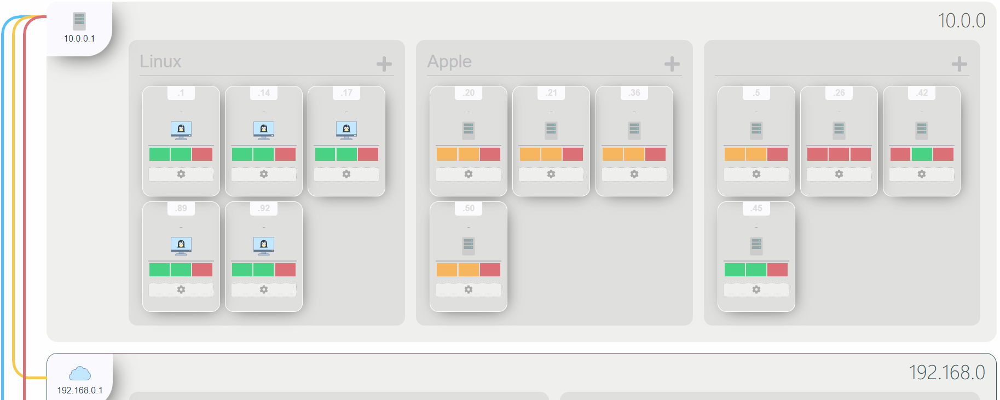

[](https://github.com/amunchet/labyrinth/actions/workflows/push.yml)


# Labyrinth
The beautiful network analyzer, mapper, and monitor.




## Install
1. `sudo bash install.sh` - this will walk you through the setup needed for Auth0 information.
2.  If you are running docker as non-root, then remove the top section from `install.sh` and re-run.

## Redis notes
Redis is also going to be used a write cache for incoming metrics.  This way, the load on the metric database server will be greatly reduced.  We can tune the time to write the metrics as well.

## Database Notes

### Attempt 2
I'm converting the Mongo databsae to a timeseries.  This involved the following Python code:

```
db.create_collection(collection, timeseries={ 'timeField': 'timestamp', "metaField" : "metadata"})
```

I will also resume sending metrics directly to the second table.  I'll have to set up TTL at a later date (through the Mongo Shell NOT python):
```
use labyrinth

db.runCommand({
   collMod: "metrics",
   expireAfterSeconds: 2419201
})
```

### Indexes
I did a compound index of `tags.labyrinth_name`, `tags.host`, `tags.ip`, `tags.mac` - seemed to work very well.

I also added a `timestamp`, -1 index to help with the graphs.  NOTE: This didn't end up doing anything.


### Attempt 1
Labyrinth is depending on a Mongo Database trigger to move metrics from `metrics-latest` to `metrics` collection.  

Here is the trigger's javascript code (I'm personally running it at 15 minute intervals):
```
exports = async function() {
  /*
    A Scheduled Trigger will always call a function without arguments.
    Documentation on Triggers: https://www.mongodb.com/docs/atlas/app-services/triggers/overview/

    Functions run by Triggers are run as System users and have full access to Services, Functions, and MongoDB Data.

    Access a mongodb service:
    const collection = context.services.get(<SERVICE_NAME>).db("db_name").collection("coll_name");
    const doc = collection.findOne({ name: "mongodb" });

    Note: In Atlas Triggers, the service name is defaulted to the cluster name.

    Call other named functions if they are defined in your application:
    const result = context.functions.execute("function_name", arg1, arg2);

    Access the default http client and execute a GET request:
    const response = context.http.get({ url: <URL> })

    Learn more about http client here: https://www.mongodb.com/docs/atlas/app-services/functions/context/#std-label-context-http
  */
  const mongodb = context.services.get("XXXXXX"); // Company name
  const metrics_current  = mongodb.db("labyrinth").collection("metrics-latest");
  
  
  return await metrics_current.aggregate([{"$project" : { "_id" : 0 }}, {"$merge" : "metrics"}]).toArray()
};


```


## FAQ
### 1.  Aren't you reinventing the wheel?
Sure - to some extent.  Labyrinth is built upon very solid projects: NMap, Ansible, and Telegraf.  

However, Labyrinth does some things better than other popular projects: 
- Labyrinth looks good.  Yes, you can use Grafana to make pretty good dashboards, but I want something that's naturally nice looking and simple.  Grafana dashboards are endlessly customizable, and by that virtue - never completed.  Grafana also struggles a little with multi-host displays - I wasn't able to make it look *quite* like I wanted.

- Labyrinth has better autodiscovery: port scanning.  Projects like Prometheus have auto discovery, but they are very cloud-centric.  Labyrinth fits best in a on-prem or hybrid situation, with many different kinds of clients joining and leaving.  TCP/UDP are some of the fundamental protocols: if you can't communicate over them, something's probably wrong.  Furthermore, Labyrinth wants to know if something unexpected has happened: a port being openend or closed, a new client that wasn't supposed to be in that subnet, etc.

- Labyrinth has simple management.  By using Ansible and Telegraf, it's very easy to provision from the web interface.  Don't want to do that?  No problem - the ports based nature of Labyrinth can give a good idea of network status without an agent.

- Labyrinth is easy.  Start it up as a docker, use the web interface, done - up and running in minutes.  If you want to get into Telegraf configuration files, you're able to do that.

### 2.  What does Labyrinth NOT do well?
Labyrinth is meant for hybrid, dynamic, check based network management.  For homogenous services or full cloud offerings, there are tons of better projects: Prometheus, ELK stack, Sensu Go, etc.  

Labyrinth also isn't built with metric analysis or time-series in mind - you can do them, but there are tons of better tools out there: Graylog, ELK, etc.

Labyrinth is built for smaller to midsize networks - I simply don't know how it works on large networks, since I'm building to solve my problem.

### 3.  Who is Labyrinth made for?
Labyrinth is for whatever poor sysadmin has a small to midsize network they can't keep up with - and they just want something easy and pretty to occasionally look at.  Whether that's a homelab admin or a one-man devops band, Labyrinth is here to help.

### 4.  Can you use it with Kubernetes?
You probably can use Labyrinth for K8, but there are plenty of better, specialized tools that you should probably use instead.

## Development
Start a development docker-compose stack with the following commands:
- `docker-compose -f docker-compose-development.yml up --build -d`
- Port `8100` will be the Vue frontend server.  Go there to start up the development server.
- Once the Vue frontend server has been started, navigate to `:8101` to see the live frontend.
- Certificates: you may need to point your browser to `:7200` to accept the self-signed certificate.  If you navigate to the frontend without doing that, you will receive "Network Error" messages.

# TODO
- Documentation on setting up Auth0 for the system.  Also notes on how to disable using auth (can just have it as an ENV variable in the docker compose)

# Other Wonderful Projects
- https://github.com/SabyasachiRana/WebMap - although this project is pretty quiet currently, this had lots of good ideas.  I just wish it was more of a network management tool than just scanning.
- Prometheus
- Sensu Go
- etc.
